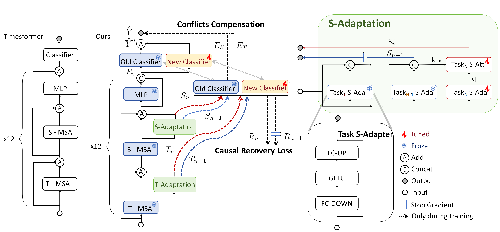

<h2 align="center"> <a href="https://arxiv.org/abs/2501.07236">CSTA: Spatial-Temporal Causal Adaptive Learning for Exemplar-Free Video Class-Incremental Learning</a></h2>

<h5 align="center"> IEEE T-CSVT Under Review </h2>

<h5 align="center"> If you like our project, please give us a star ⭐ on GitHub for latest update.  </h2>

[](https://arxiv.org/abs/2501.07236) <br>

## 🏠 Overview
Official Implement of CSTA: Spatial-Temporal Causal Adaptive Learning for Exemplar-Free Video Class-Incremental Learning



Continual learning aims to acquire new knowledge while retaining past information. Class-incremental learning (CIL) 
presents a challenging scenario where classes are introduced sequentially. For video data, the task becomes more 
complex than image data because it requires learning and preserving both spatial appearance and temporal action involvement. 
To address this challenge, we propose a novel exemplar-free framework that equips separate spatiotemporal adapters to 
learn new class patterns, accommodating the incremental information representation requirements unique to each class. 

While separate adapters are proven to mitigate forgetting and fit unique requirements, naively applying them hinders the 
intrinsic connection between spatial and temporal information increments, affecting the efficiency of representing newly 
learned class information. Motivated by this, we introduce two key innovations from a causal perspective. 

First, a causal distillation module is devised to maintain the relation between spatial-temporal knowledge for a more 
efficient representation. Second, a causal compensation mechanism is proposed to reduce the conflicts during increment 
and memorization between different types of information. 

Extensive experiments conducted on benchmark datasets demonstrate that our framework can achieve new state-of-the-art 
results, surpassing current example-based methods by 4.2% in accuracy on average.


## 🗝️ Training & Validating 
For training and our validating CSTA on every dataset, please follow the command below:

#### 📃 Kinetics
```bash
sh experiments/train_kinetics1.sh 
```

#### 📃 ActivityNet
```bash
sh experiments/train_activity1.sh 
```

#### 📃 HMDB51
```bash
sh experiments/train_hmdb1.sh 
```

#### 📃 SSV2
```bash
sh experiments/train_ssv2.sh 
```

#### 📃 UCF101
```bash
sh experiments/train_ucf1.sh 
```

## 🛠️ Requirements and Installation
We offer an environment suitable for CSTA:
```bash
conda create -n csta python=3.10
conda activate csta
pip install -r requirements.txt
```

## ✏️ Citation
```bash
@article{chen2025csta,
  title={CSTA: Spatial-Temporal Causal Adaptive Learning for Exemplar-Free Video Class-Incremental Learning},
  author={Chen, Tieyuan and Liu, Huabin and Lim, Chern Hong and See, John and Gao, Xing and Hou, Junhui and Lin, Weiyao},
  journal={arXiv preprint arXiv:2501.07236},
  year={2025}
}
```